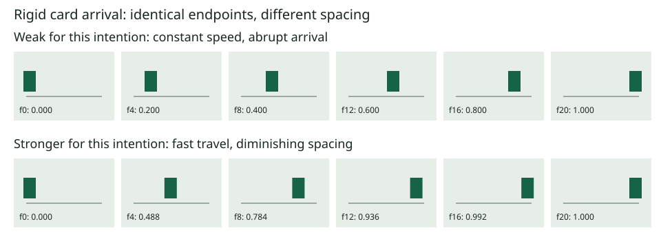

# Visual lessons — relationships, not costumes

Use these to calibrate implementation, not copy the sample palette. The bundled examples have
**offline compile/baker tests**, not a new cloud-rendered seal of approval. Renderer-sensitive
proofs and human preference trials remain separate. [Evidence register](../qa/evidence-index.md).

## 1. Same arrival, different physical character

Intention: a rigid information card arrives decisively, then rests. Equal spacing all the way to
the mark makes its stop abrupt; diminishing spacing gives it a clean settle without bounce.

This is a diagram generated from real `bake()` samples, **not cloud-rendered frames**. At 25 fps
both moves last 20 frames and share endpoints. Linear is not inherently bad: it is right for
constant-speed/mechanical motion. For this arrival, `outCubic` better expresses the intended settle.
A filmstrip of the rendered element must still check blur and neighboring motion.

Source: [group reveal](../examples/runnable-scenes.md#group-reveal). Transfer the spacing and
hierarchy to an unseen subject; do not transfer its green palette or panel layout automatically.

## 2. A typewriter needs intermediate states

| Sample frame at 25 fps | Incomplete two-key hold scaffold | Corrected selection |
|---|---|---|
| 0 | hidden | hidden |
| 10 | hidden | T |
| 20 | hidden | TY |
| 30 | hidden | TYP |
| 40 | sudden whole-word change only if its final key is here | TYPE |

The right column is **intended glyph order**, based on tested square/pinned selection values
0, .25, .5, .75, 1. Actual glyph/range rendering still needs cloud proof. The old two-key scaffold
held 0 until its final key. [Complete typewriter](../examples/runnable-scenes.md#typewriter).
A caret must use real glyph advances or an explicitly monospaced layout, never guessed proportional widths.

## 3. A locked end card is not missing motion

Weak: footage unexpectedly runs out and the final image is held to fill the slot.
Strong: a deliberately locked, composed card gives the viewer time to read and act.
They may have the same detector statistic. The difference is source coverage, purpose and reading.
Do not add grain or a slow push only to avoid a freeze report. See
[hold classification](../make/design-contract.md#hold-classification).

## 4. Group once, then choreograph children where earned

Weak: copy the same position keys to panel, rule and marker; later edits desynchronize them.
Strong: a sub-comp carries the shared movement; only intentional child reactions get local motion.
[Group scene](../examples/runnable-scenes.md#group-reveal). A rigid object does not need every part
to lag; follow-through should reflect material, not a universal animation rule.

## 5. Draw the information, not decoration

Weak: a rotating complete ring is described as a percentage fill, although rotation never changes
its amount. Strong: reveal the actual arc or route fraction, with a label tied to the same data.
[Path reveal](../examples/runnable-scenes.md#path-reveal) demonstrates native trim construction;
[data strategy](../engine/personalization.md#chart-strategy--choose-before-authoring) explains when
geometry must be rebuilt. A native chart is not honest if only its number changes per viewer.

## 6. Parallax and compositing need actual spatial proof

Weak: put every layer at z=0 and call it 3D, or slide an unrelated cut-out over a plate.
Strong: calibrated depth and motivated camera travel, or an aligned same-source occlusion layer.
[Camera fixture](../examples/runnable-scenes.md#camera-parallax) compiles offline; a cloud proof
must check projected position, paint order and motion blur. Matte-edge and sound-picture lessons
need real source clips and listening evidence; do not invent comparison footage or a preference win.

## Building the rendered curriculum

Use the repository's `evals/agent/` workflow: fixed approved assets/briefs, isolated skill variants,
recorded model/configuration and repeat trials. Render agent-authored outputs only with an approved
library/budget. Export neutral A/B files; a person compares fit, hierarchy, type, motion, compositing,
sound and restraint. Retain source scenes, hashes and timecoded findings. Replace a lesson's pending
proof label only after the actual evidence exists. Until then these diagrams teach mechanics,
not a claim that the entire skill has won a visual evaluation.
